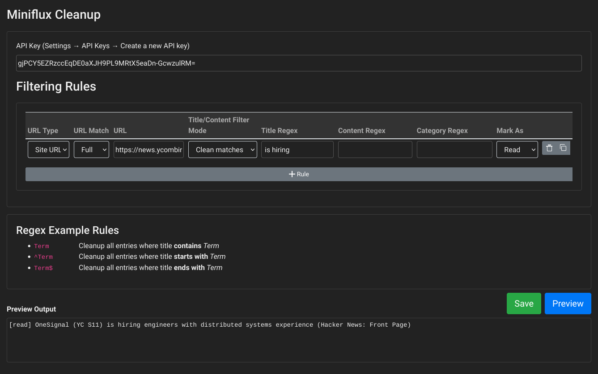

# Miniflux Cleanup

[Miniflux](https://miniflux.app/) is a great RSS Feed Reader, but has limited support for filtering spam out of feeds.

This tool watches out for new posts and applies the filtering rules to them (see below).

## Setup

```yaml
version: '3'
services:
  miniflux-cleanup:
    image: knrdl/miniflux-cleanup
    restart: always
    environment:
      MINIFLUX_URL: http://miniflux:8080  # the URL where to find your miniflux instance
      AUTH_PROXY_HEADER: 'X-Username'     # optional: read username from http header (multi-user mode)
      DEFAULT_USERNAME: admin             # optional: ... or use this one (single-user mode)
      CRONJOB_INTERVAL: 10s               # search interval for new posts
    ports:
      - "8080:8080"
```

## Screenshot

No feast for the eyes, but does the job ...



